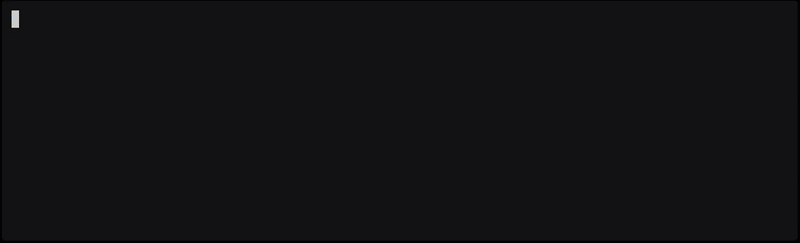

<h1 align="center" style="border-bottom: none">
  <a href="https://prequel.dev" target="_blank">
    
  </a>
  <br>
  preq
</h1>

<p align="center">
  Visit <a href="https://docs.prequel.dev" target="_blank">docs.prequel.dev</a> for full documentation,
  examples, and guides.
</p>

<div align="center">

[](https://github.com/prequel-dev/preq/actions/workflows/build.yml)
[](#)
[](https://github.com/prequel-dev/preq/releases)
[](https://www.apache.org/licenses/LICENSE-2.0)
[](https://inviter.co/prequel)
[](https://play.prequel.dev/)
[](#kubernetes-krew)

</div>

---
`preq` (prounounced "preek") is a free and open community-driven reliability problem detector

<p align="center">
  
</p>

Use `preq` to:

- detect the latest bugs, misconfigurations, anti-patterns, and known issues from a community of practitioners
- provide engineers, on-call support, and SRE agents with impact and community recommended mitigations
- hunt for new problems in distributed systems

`preq` is powered by [Common Reliability Enumerations (CREs)](https://github.com/prequel-dev/cre) that are contributed by the community and Prequel's Reliability Research Team. Reliability intelligence helps teams see a broad range of problems earlier, so they can prioritize, pinpoint, and reduce the risk of outages.


## Install `preq`

### Binary Distributions

Official binary distributions are available at [latest release](https://github.com/prequel-dev/preq/releases) for Linux (amd64), macOS (amd64 and arm64), and Windows (amd64). All macOS binaries are signed and notarized. No configuration is necessary to start using preq.

### Kubernetes

You can also install `preq` as a Krew plugin:

```bash
kubectl krew install preq
```

See https://docs.prequel.dev/install for more information.

## Quick Usage

**Step 1**: Install and run the demo service

```bash
curl -sL "$(curl -s https://api.github.com/repos/prequel-dev/preq-demo-app/releases/latest \
  | jq -r '.assets[] | select(.name | test("demo-darwin-arm64$")) .browser_download_url')" \
  -o demo && chmod +x demo && ./demo > preq-demo.log 2>&1
```
**Step 2**: Trigger a problem
```bash
curl http://localhost:8080/panic
```
**Step 3**: Detect the problem
```bash
cat preq-demo.log | preq -o -
```
You’ll see a detection printed with the corresponding CRE ID, severity, and suggested mitigation.

```bash
Parsing rules           done! [3 rules in 3ms; 433 rules/s]
Problems detected       done! [1 in 7ms; 144/s]
Reading stdin           done! [208.64KB in 4ms; 53.01MB/s]
Matching lines          done! [1.01K lines in 4ms; 275.29K lines/s]
CRE-2025-0918        critical [1 hits @ 2025-03-11T10:00:19-04:00]
```
See our running preq guide for full walkthrough, including writing your own rules: https://docs.prequel.dev/running


## Example CRE

This rule detects a specific sequence of events from one log source within a set time period. It also checks that a certain event doesn’t occur during that period. If it does, the rule will not trigger.

```yaml title="cre-2024-0007.yaml" showLineNumbers
cre:
  id: CRE-2024-0007
  severity: 0
  title: RabbitMQ Mnesia overloaded recovering persistent queues
  category: message-queue-problems
  author: Prequel
  description: |
    - The RabbitMQ cluster is processing a large number of persistent mirrored queues at boot. 
  cause: |
    - The Erlang process, Mnesia, is overloaded while recovering persistent queues on boot. 
  impact: |
    - RabbitMQ is unable to process any new messages and can cause outages in consumers and producers.
  tags: 
    - cre-2024-0007
    - known-problem
    - rabbitmq
  mitigation: |
    - Adjusting mirroring policies to limit the number of mirrored queues
    - Remove high-availability policies from queues
    - Add additional CPU resources and restart the RabbitMQ cluster
    - Use [lazy queues](https://www.rabbitmq.com/docs/lazy-queues) to avoid incurring the costs of writing data to disk 
  references:
    - https://groups.google.com/g/rabbitmq-users/c/ekV9tTBRZms/m/1EXw-ruuBQAJ
  applications:
    - name: "rabbitmq"
      version: "3.9.x"
metadata:
  kind: prequel
  id: 5UD1RZxGC5LJQnVpAkV11A
  generation: 1
rule:
  sequence:
    window: 30s
    event:
      src: log
      container_name: rabbitmq
    order:
      - regex: Discarding message(.+)in an old incarnation(.+)of this node
      - Mnesia is overloaded
    negate:
      - SIGTERM received - shutting down
```

## Automated Actions using preq

You can connect detections to automated runbooks that take action when a CRE fires. For example, restarting a service or notifying your on-call team.

You can run automated actions on new detections using `preq -a <actions.yaml>`.

See https://docs.prequel.dev/running#automated-runbooks for examples of how to setup automated runbooks when a CRE is detected and trigger actions like:
- Slack Notifications
- Jira Issue Creation
- Runbook executables
- CronJobs

## Data sources other than `stdin`

`preq` works on any timestamped data source, not just `stdin`.
You can define multiple sources (e.g., app logs, system logs, metrics dumps) in a YAML template and let preq automatically map CRE rules to the right data.

Learn more about data sources here: https://docs.prequel.dev/data-sources

## Community
We’re building an open reliability detection community and we’d love you to join!

- [Slack](https://inviter.co/prequel): Ask questions, share detections, propose new CREs. 

- [Playground](https://play.prequel.dev/): Try rules in your browser with WebAssembly, no data leaves your machine.

- [Docs](https://docs.prequel.dev): Explore the documentation to learn how to install, run, automate, and write CREs.

- [CRE Repository](https://github.com/prequel-dev/cre): Contribute new community detection rules and help the reliability community grow.

## Contributing

We welcome contributions of all kinds: bug fixes, docs, new CRE rules, or feature ideas!

See the contribution guide for more details: https://docs.prequel.dev/cres/contributing

---
Licensed under the [Apache License 2.0](https://github.com/prequel-dev/preq/blob/main/LICENSE)
